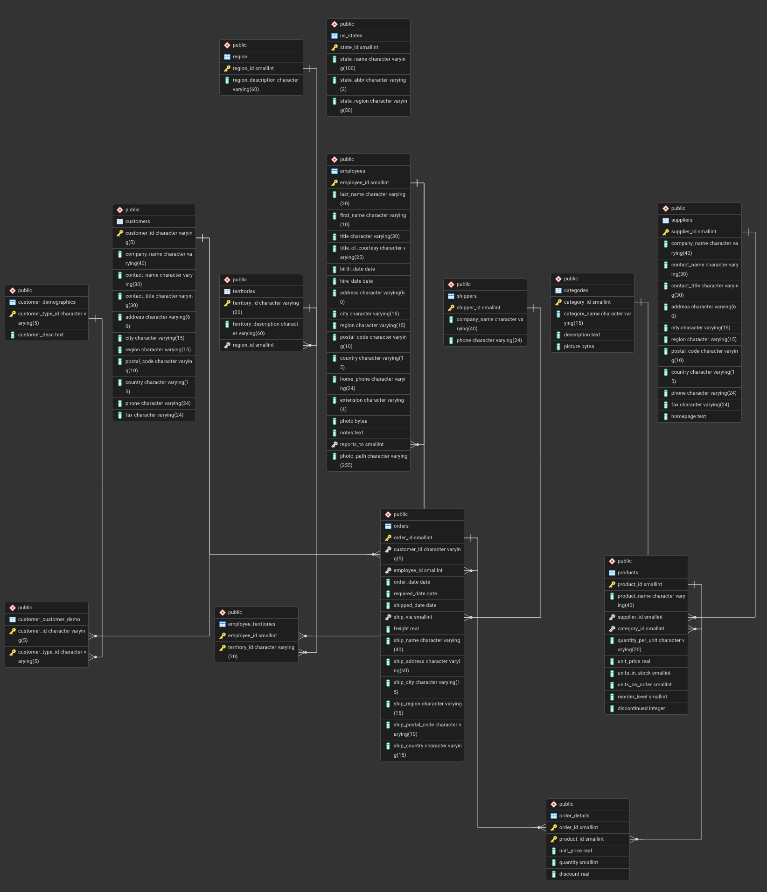
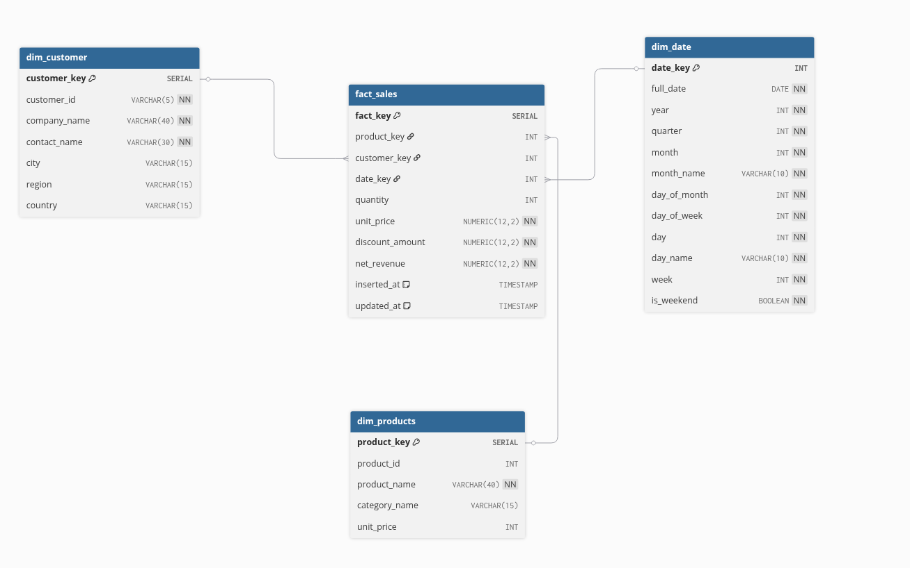

# Showcase FROM OLTP TO OLAP

This project is using Northwind database from SQL. ([Origin source](https://github.com/pthom/northwind_psql/))

##  ERD of Northwind dataset.




## Project Setup
This project is using docker compose for the infrastructure. 

1. You may need to change the profile. Update the .env file for this needs.
2. Make sure docker and docker compose already installed on your device and run `docker compose up`
3. Open the pgadmin `localhost:5050`
4. Setup the server.
5. Create the connection to postgres.
    - General tab (name): define you server name (e.g: northwind)
    - Connection tab (use the variable that already define from .env file):
        - hostname/address: use the postgres container name (my-postgres-container)
        - password: use the postgres password (postgres)


Check the schema
```
select
	column_name,
	data_type,
	character_maximum_length,
	is_nullable,
	column_default
FROM
	information_schema.columns
WHERE
	table_name = 'TABLE_NAME';
```

# DDL FOR OLAP

See `olap-model.sql` for the DDL. It defines the OLAP data model used for analytics.



This model is designed to support analytics for the business unit, with a focus on revenue derived from sales.

We pre-calculate `net_revenue` in `fact_sales` because it is used frequently across analytics queries and reports.

Note that `fact_sales` stores foreign keys that reference the related dimension tables.
